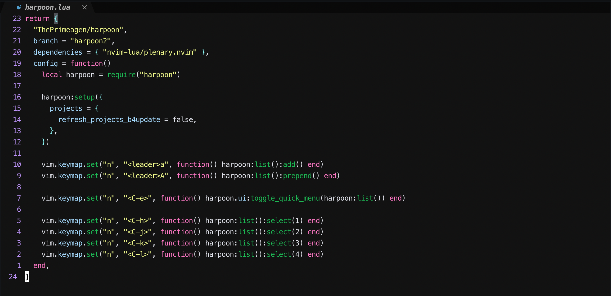

# bo-banana-bread.nvim



A Spotify-inspired dark theme for Neovim

## Installation

Using [lazy.nvim](https://github.com/folke/lazy.nvim):
```lua
{
  "sahilNaran/bo-banana-bread.nvim",
  priority = 1000,
  config = function()
    vim.cmd.colorscheme("bo-banana-bread")
  end,
}
```

Using [packer.nvim](https://github.com/wbthomason/packer.nvim):
```lua
use({
  "sahilNaran/bo-banana-bread.nvim",
  config = function()
    vim.cmd.colorscheme("bo-banana-bread")
  end
})
```


inspired by some VSCode theme, TODO: find the name and give credit

